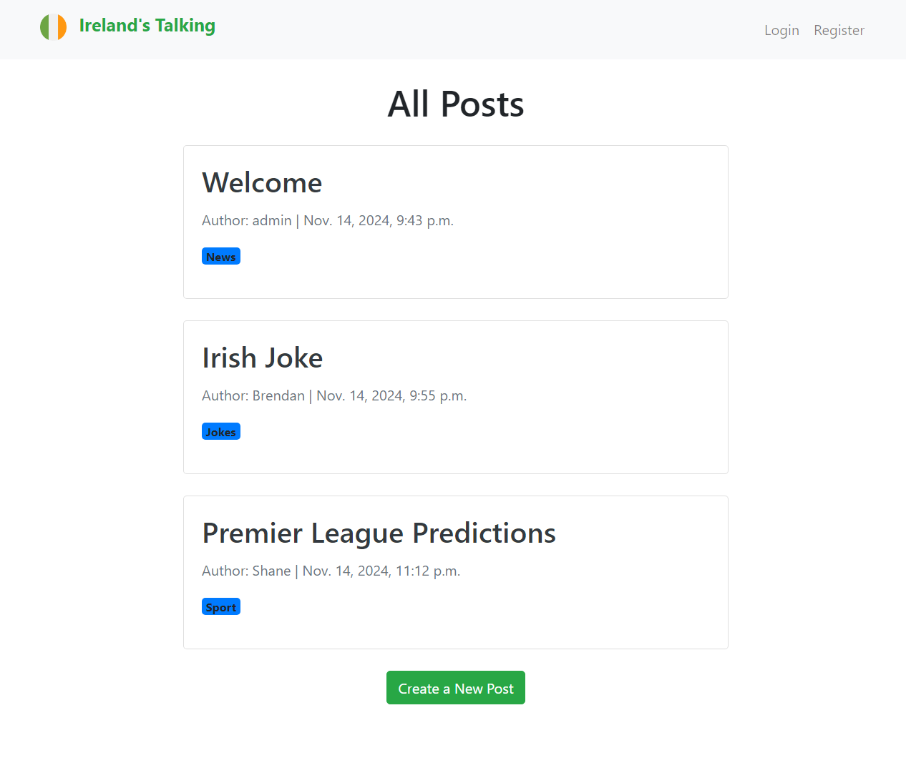
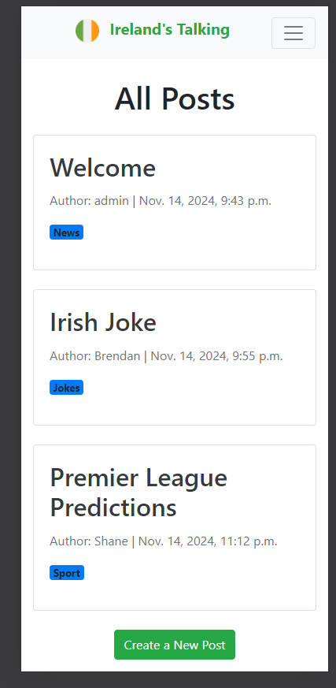
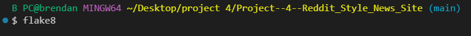

# Reddit-Style News Site

The Reddit-Style News Site is a Django-based full-stack web application where users can create posts, comment, and upvote posts and comments. The platform features a categorized system to organize content and interactions through voting.

### Desktop View
Here is a screenshot of the desktop view of the application:



### Mobile View
Here is a screenshot of the mobile view of the application:



## Wireframe: Ireland's Talking

- Main Page

```
+-----------------------------------------------------------------+
| Ireland's Talking                           [Login]  [Register] |
+-----------------------------------------------------------------+
+-----------------------------------------------------------------+
|                                                                 |
|   +-----------------------------------------------+             |
|   | Post Title:                                   |             |
|   | Author:                   |  Date  |          |             |
|   +-----------------------------------------------+             |
|                                                                 |
|   +-----------------------------------------------+             |
|   | Post Title:                                   |             |
|   | Author:                   |  Date  |          |             |
|   +-----------------------------------------------+             |
|                                                                 |
|   +-----------------------------------------------+             |
|   | Post Title:                                   |             |
|   | Author:                   |  Date  |          |             |
|   +-----------------------------------------------+             |
|                                                                 |
|                   [Create New Post]                             |
|                                                                 |
+-----------------------------------------------------------------+
```
- Post Page
```
+-------------------------------------------------------------------------------------+
| Ireland's Talking                                                 [ Logout ]        |
+-------------------------------------------------------------------------------------+
|                                  Post Title                                         |
|                              Post Author and Date                                   |
+-------------------------------------------------------------------------------------+
|                                                                                     |
| (Full post content here)                                                            |
|                                                                                     |
| Upvotes: 0        [Upvote Post]                                 Category:           |
+-------------------------------------------------------------------------------------+
|                                        Comments                                     |
+-------------------------------------------------------------------------------------+
| Post Reply: Post Content                                                            |
| Upvotes:           [Upvote Comment]         [Delete Comment]                        |
+-------------------------------------------------------------------------------------+
| Post Reply: Post Content                                                            |
| Upvotes:           [Upvote Comment]         [Delete Comment]                        |
+-------------------------------------------------------------------------------------+
| [ Add Comment Field ]                                                               |
|                                                                                     |
| [Add Comment]         [Edit Post]         [Delete Post]                             |
+-------------------------------------------------------------------------------------+
```

### Design Overview

1. **Header**
   - **Site Title/Logo:** “Ireland’s Talking” (top-left).
   - **Auth Links:** 
     - When logged out: “Login” and “Register” (top-right).
     - When logged in: “Logout” and user profile/options.

2. **All Posts (Main Content)**
   - **Heading:** “All Posts” in a prominent position.
   - **Posts List:** Each post is presented in a simple card-like layout that includes:
     - **Title**
     - **Author Name and Timestamp**
     - **Optional Category or Tag**
     - **Upvotes** (if desired, or link to post detail for more info)
   - **Create a New Post Button:** Centered or clearly visible to encourage posting.

3. **Post Detail View**
   - **Title and Metadata:**
     - Post title in a large, prominent font.
     - Author name and post timestamp below the title.
   - **Post Content:**
     - Main text of the post.
   - **Post Actions:**
     - **Upvote Button/Count:** Displays current upvotes and allows user to upvote if logged in.
     - **Edit/Delete Buttons:** Shown if the logged-in user is the post author.
     - **Category:** If used, displayed near the upvote count or at the bottom of the post content.
   - **Comments Section:**
     - **Comment List:** Each comment includes author, timestamp, and upvote count.
     - **Comment Actions:** Logged-in users can upvote or delete their own comments.
     - **Add Comment Form:** Text area and submit button for logged-in users.
       - If the user is not logged in, prompt them to log in to comment or upvote.


### Design Considerations

- **Responsive Layout:**
  - Ensure the header (logo and auth links) rearrange or collapse on smaller screens.
  - Both the All Posts page and the Post Detail page should adapt gracefully to mobile.

- **Readability:**
  - Use clear font sizes and spacing for titles, authors, timestamps, and body text.
  - Ensure that upvote buttons and comment sections are easy to spot.

- **Call-to-Action:**
  - On the All Posts page, the “Create a New Post” button should stand out to prompt user engagement.
  - On the Post Detail page, the “Add Comment” field should be visible and intuitive for logged-in users.

- **User Flow & Permissions:**
  - Differentiate between logged-in and logged-out users.
    - Logged-out users see “Login” or “Register” prompts for actions like upvoting or commenting.
    - Logged-in users see “Logout,” plus upvote/comment/edit/delete options if they own the post/comment.

- **Consistency:**
  - Keep headers and color schemes consistent across both pages.
  - Use the same design language for post cards on the All Posts page and the post detail layout.

## Features

### Existing Features

- **User Registration and Authentication**
  - Users can register for an account, log in, and log out using Django's built-in authentication.
  - Authentication checks ensure that only registered users can interact with certain features such as creating posts, commenting, and upvoting.

- **Post Creation and Categories**
  - Authenticated users can create posts. Each post has a title, content, and an optional category.
  - Categories help organize posts.

- **Commenting System**
  - Users can comment on posts. Comments are displayed under the post and are available for viewing by all users.
  - Only authenticated users can add comments, and they are saved under the user who posted them.

- **Upvoting System**
  - Both posts and comments can be upvoted by authenticated users.
  - Users can only upvote a post or comment once, ensuring fair voting.
  - The upvote count is displayed next to each post and comment and is updated in real-time.

- **CRUD Functionality**
  - **Create**: Authenticated users can create new posts and comments.
  - **Read**: All users can read posts, comments, and browse by category.
  - **Update**: Users can edit their own posts directly from the front end.
  - **Delete**: Users can delete their own posts without needing to access the admin panel.

- **Dynamic User Interface**
  - The website features a responsive UI using Bootstrap for styling.
  - UI includes buttons for creating, editing, deleting, and upvoting posts/comments.

### Features Left to Implement

- **User Profiles**
  - Allow users to customise their own profile. Add information like, location, age ,etc

- **Social Features**  
  - Adding a "follow" feature for users to follow each other and view posts from followed users.

- **Sorting and Filtering**
  - Adding sorting options such as "Most Upvoted" or "Newest" for posts to provide a more customized experience.

- **Social Sharing**
  - Adding options for users to share posts directly to social media.

## Planning and Development

### Site Planning Steps:
- **Initial Setup**:
  - Set up Django project and configure environment.
  - Set up a GitHub repository and managed version control using Git.
- **User Stories and GitHub Project Board**:
  - Used Agile methodologies for planning. User stories were tracked using GitHub Project Boards.
- **Model Creation**:
  - Created models for `Post`, `Comment`, `Category`, and `UserProfile`.
- **Backend Features**:
  - Implemented CRUD functionalities, category assignment, and the upvoting system.
- **Frontend Implementation**:
  - Created responsive templates using HTML, CSS (Bootstrap), and implemented forms for post creation and comment interaction.
- **Deployment**:
  - Set up environment variables, used Whitenoise for static file handling, and deployed on Heroku.  

## Libraries Used

- **Django**: Main framework used for web development and back-end.
- **Bootstrap**: Used to create a responsive design.
- **Gunicorn**: WSGI server used for running the app on Heroku.
- **Whitenoise**: Static file management to serve CSS, JavaScript, and image files during deployment.

## Testing

- **Manual Testing**: Each feature has been manually tested to ensure proper functioning.
- **Automated Testing**: Code was run through Flake8 and no errors identified. Image of test result below.

  
  _

### Manual Testing

| Action | Expected Behaviour | Pass or Fail | Notes |
|--------|--------------------|--------------|-------|
| User Registration | User should be able to register an account and receive a confirmation message | Pass | |
| Login and Logout | User should be able to log in and log out of their account | Pass | |
| Create a Post | Logged-in users can create new posts with title and content | Pass | |
| Create a Comment | Logged-in users can comment on posts, and the comment is displayed below the post | Pass | |
| Upvote a Post | User can upvote a post, and the count updates | Pass | |
| Upvote a Comment | User can upvote a comment, and the count updates | Pass | |
| Edit Post | Users can edit only their own posts | Pass | |
| Delete Post | Users can delete their own posts | Pass | |
| Prevent Unauthorized Access | Unauthorized users cannot access restricted actions like creating a post or commenting | Pass | |

### Unfixed Bugs

No known bugs were found at the time of project completion.

## Deployment

### GitHub

The project was deployed to GitHub for version control and collaboration. The link to the GitHub repository is:

- [GitHub Repository Link](https://github.com/BrendanGCollins/Project--4--Reddit_Style_News_Site)

### Heroku

The site was also deployed on **Heroku**. Below are the steps taken for deployment:

1. **Step 1**: Sign up or log in to **Heroku**.
2. **Step 2**: Ensure you have a `requirements.txt` file that contains all dependencies.
3. **Step 3**: Create a new Heroku application.
4. **Step 4**: Connect to GitHub and choose the repository containing the project.
5. **Step 5**: Set environment variables including `SECRET_KEY` and configure `DEBUG = False`.
6. **Step 6**: Add `whitenoise` and `gunicorn` to handle static files and manage the WSGI server.
7. **Step 7**: Deploy the project and test to ensure the app is working correctly.

The live link to the project can be found here:

- [Live Heroku Deployment](https://reddit-style-news-site-44d5820c6a01.herokuapp.com/)

## Credits

- **Stack Overflow**: Helpful discussions and solutions for debugging.
- **YouTube Tutorials** - Channels such as `Traversy Media` and `Academind` helped to understand Django features.

### Libraries

- **Django**: Used for creating models, views, and handling back-end functionalities.
- **Bootstrap**: For a responsive and user-friendly front-end.
- **Whitenoise**: Static file handling for deployment on Heroku.
- **Gunicorn**: Used for deployment as the WSGI server.  